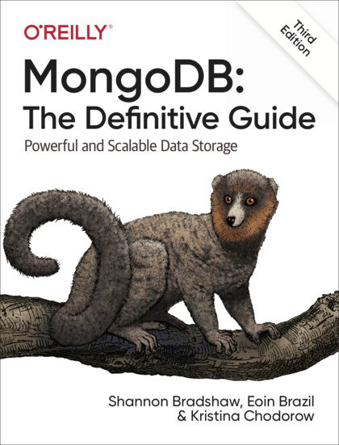

In this book, [Shannon Bradshaw](https://twitter.com/shannonbradshaw) and [Eoin Brazil](https://twitter.com/eoinbrazil) teach you how to develop modern applications using MongoDB. We cover everything from introducting the document model to scaling your data via sharding as well as guidance for security and administration of MongoDB. This book will provide you with a solid understanding of MongoDB and the document model, no previous knowledge is assumed or required.

As of end of November 2019 the book is available [via Safari](https://learning.oreilly.com/library/view/mongodb-the-definitive/9781491954454/) and in print by late December 2019.

All the code examples used in the book are available here:

* [code](TBD): TODO.

Follow online at [MongoDB Book on Twitter](https://twitter.com/mongodb_tdg)
